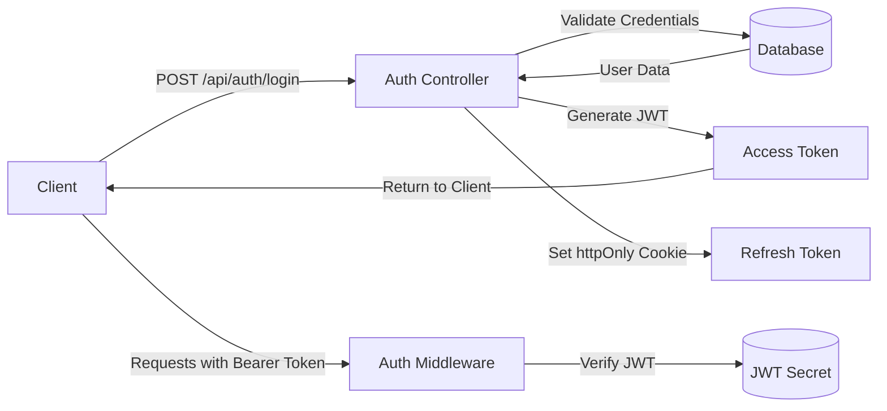
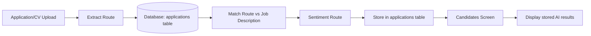
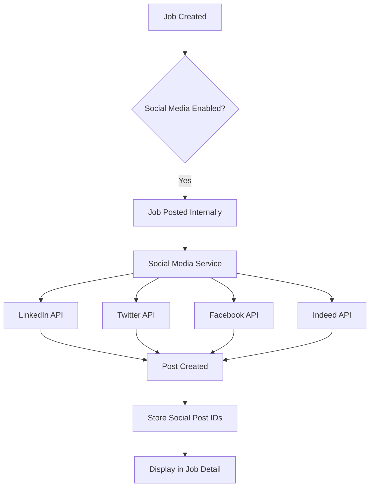

# HireFlow Technical Analysis & Requirements Document

**Document Version:** 1.0  
**Date:** March 27, 2026  
**Author:** Architect Mode Analysis

---

## Table of Contents

1. [JWT Authentication](#1-jwt-authentication)
2. [AI Analysis Integration](#2-ai-analysis-integration)
3. [Social Media Job Posting](#3-social-media-job-posting)
4. [Full Functionality Analysis](#4-full-functionality-analysis)

---

## 1. JWT Authentication

### 1.1 Current Implementation Status

The HireFlow application currently has a **mock authentication system** with the following characteristics:

#### Frontend Auth Store ([`src/features/auth/store/authStore.ts`](src/features/auth/store/authStore.ts))
- Uses Zustand for state management
- Stores user data in memory (NOT persisted to localStorage)
- Access token is stored in memory via API client
- Supports role-based access control (RBAC): `Admin`, `Recruiter`, `Interviewer`, `Read-only`
- Refresh token intended to be httpOnly cookie (not yet implemented)

#### Login Component ([`src/components/Login.tsx`](src/components/Login.tsx))
- Mock login with pre-filled credentials: `tino@hireflow.io`
- Role selector allows choosing any role for demo purposes
- No actual server-side authentication

#### Backend Authentication
- **No JWT implementation exists on the server**
- No `/api/auth/*` routes found
- No token validation middleware
- Public endpoints have no auth protection

### 1.2 Requirements for Secure JWT Authentication

#### Server-Side Requirements



**Required Implementation:**

| Component | File | Description |
|-----------|------|-------------|
| Auth Routes | `server/routes/auth.ts` (new) | POST /login, POST /refresh, POST /logout |
| JWT Middleware | `server/middleware/auth.ts` (new) | Verify Bearer token on protected routes |
| User Model | `server/models/user.ts` (new) | Database schema for users |
| Password Hashing | `bcryptjs` | Hash passwords before storage |
| JWT Library | `jsonwebtoken` | Generate and verify tokens |

**Environment Variables Required:**
```env
JWT_SECRET=your-secure-random-string-min-32-chars
JWT_EXPIRES_IN=15m
JWT_REFRESH_SECRET=your-secure-refresh-secret
JWT_REFRESH_EXPIRES_IN=7d
```

#### Client-Side Requirements

| Component | Current | Required |
|-----------|---------|----------|
| Login Form | Mock | Real credentials, error handling |
| Token Storage | Memory | Access token in memory, refresh in httpOnly cookie |
| Auth Interceptor | Basic | Auto-refresh on 401, logout on refresh failure |
| Protected Routes | None | Redirect to login if unauthenticated |

### 1.3 Security Considerations

1. **Token Storage**: Access tokens should remain in memory; refresh tokens must use httpOnly cookies
2. **HTTPS Only**: All auth endpoints must require HTTPS in production
3. **Password Requirements**: Minimum 8 characters, require mixed case, numbers, special chars
4. **Rate Limiting**: Prevent brute-force attacks on login endpoint
5. **Session Timeout**: Access tokens expire in 15 minutes; refresh tokens in 7 days

---

## 2. AI Analysis Integration

### 2.1 Current Implementation Status

HireFlow has a complete AI analysis pipeline with three distinct endpoints:

#### Backend Routes

| Route | File | Model | Function |
|-------|------|-------|----------|
| `/api/analyse/extract` | [`server/routes/extract.ts`](server/routes/extract.ts) | Mistral-7B | Parse CV into structured data |
| `/api/analyse/match` | [`server/routes/match.ts`](server/routes/match.ts) | Mistral + MiniLM | Score candidate vs job description |
| `/api/analyse/sentiment` | [`server/routes/sentiment.ts`](server/routes/sentiment.ts) | RoBERTa + BART + Mistral | Analyze tone and writing quality |

#### API Response Types

```typescript
// ExtractResult - CV Parsing
interface ExtractResult {
  name: string | null;
  email: string | null;
  phone: string | null;
  location: string | null;
  title: string | null;
  summary: string | null;
  experience_years: number | null;
  skills: string[];
  languages: string[];
  education: { degree: string; institution: string; year: string }[];
  experience: { role: string; company: string; duration: string; highlights: string[] }[];
  certifications: string[];
  completeness_score: number;
  completeness_notes: string;
  strengths: string[];
  red_flags: string[];
}

// MatchResult - Job Matching
interface MatchResult {
  overall_score: number;
  recommendation: string;
  summary: string;
  matched_skills: string[];
  missing_skills: string[];
  bonus_skills: string[];
  experience_fit: { score: number; note: string };
  education_fit: { score: number; note: string };
  interview_questions: string[];
  risks: string[];
  category_scores: {
    skills: number;
    experience: number;
    education: number;
    soft_skills: number;
  };
}

// SentimentResult - Text Analysis
interface SentimentResult {
  sentiment: string;
  overall_tone: string;
  tone_score: number;
  clarity_score: number;
  confidence_score: number;
  professionalism_score: number;
  writing_quality_score: number;
  power_words: string[];
  weak_phrases: string[];
  action_verbs: string[];
  improvement_tips: string[];
  standout_sentence: string | null;
  readability: string;
  key_themes: string[];
  word_count: number;
}
```

#### Frontend Analysis UI ([`src/components/TextAnalysisModal.tsx`](src/components/TextAnalysisModal.tsx))
- Complete modal with three analysis tabs
- Manual text input or file upload (.txt, .md)
- Rich result display with score rings, tags, sections
- **Standalone tool - NOT integrated with candidate profiles**

### 2.2 Gap: AI Results Not Displayed on Candidates Screen

#### Current State

The Candidates screen ([`src/components/Candidates.tsx`](src/components/Candidates.tsx)) and Candidate Profile ([`src/components/CandidateProfile.tsx`](src/components/CandidateProfile.tsx)) show:

- **CandidateProfile CV Match Section (lines 172-206):**
  - Hardcoded score ring showing `candidate.score` (0-100)
  - Static SKILLS array with mock matching data:
    ```typescript
    const SKILLS = [
      { name:'Figma',          match:'yes'     as const },
      { name:'Design Systems', match:'yes'     as const },
      { name:'Prototyping',    match:'yes'     as const },
      { name:'User Research',  match:'partial' as const },
      { name:'Motion Design',  match:'no'      as const },
    ];
    ```
  - Not connected to actual AI MatchResult

#### Required Integration



**Database Schema Changes Required:**

```sql
-- Add AI analysis columns to applications table
ALTER TABLE applications ADD COLUMN extracted_data JSONB;
ALTER TABLE applications ADD COLUMN match_score INTEGER;
ALTER TABLE applications ADD COLUMN match_result JSONB;
ALTER TABLE applications ADD COLUMN sentiment_result JSONB;
ALTER TABLE applications ADD COLUMN ai_analyzed_at TIMESTAMPTZ;
```

**Frontend Changes Required:**

| Component | Changes |
|-----------|---------|
| `Candidate` type | Add `extractedData`, `matchResult`, `sentimentResult` fields |
| `CandidateProfile` | Replace static SKILLS with real match data |
| `Candidates.tsx` | Show AI analysis indicator, filter by score |
| API Service | Store and retrieve AI results with applications |
| Candidate Drawer | Display extracted skills, completeness score |

### 2.3 Requirements Summary

1. **Store AI Results**: Persist analysis results to database when CV is uploaded
2. **Auto-Analyze**: Trigger analysis pipeline on new application
3. **Display Results**: Update CandidateProfile to show real AI data
4. **Re-analyze**: Allow manual re-analysis when job description changes
5. **Caching**: Consider caching to avoid redundant AI calls

---

## 3. Social Media Job Posting

### 3.1 Current Implementation Status

#### Job Creation Flow

| Component | File | Status |
|-----------|------|--------|
| CreateJobModal | [`src/features/jobs/components/CreateJobModal.tsx`](src/features/jobs/components/CreateJobModal.tsx) | Basic form |
| Jobs Route | [`server/routes/jobs.ts`](server/routes/jobs.ts) | Stores to database |
| Job Board | [`src/components/Jobs.tsx`](src/components/Jobs.tsx) | Displays job list |

#### Current Job Form Fields
```typescript
interface NewJobFormData {
  title: string;
  company: string;
  location: string;
  type: string;
  description: string;
  requirements: string;
  salary_range: string;
  deadline: string;
  socialMedia: string[];  // Form exists but NOT implemented
  flyer: File | null;     // UI exists but NOT implemented
}
```

The `socialMedia` array field exists in the type definition but:
- No checkbox UI in CreateJobModal
- No backend endpoint for posting
- No integration with any social platform APIs

### 3.2 Requirements for Social Media Integration

#### Supported Platforms

| Platform | API | Use Case |
|----------|-----|----------|
| LinkedIn | LinkedIn Marketing API | Company page posts, job posts |
| Twitter/X | Twitter API v2 | Tweet job opening |
| Facebook | Facebook Graph API | Page posts, job listings |
| Indeed | Indeed Publisher API | Indeed job feed |

#### Implementation Architecture



#### Required Components

**Backend:**
- `server/services/social-media.ts` - Social media posting service
- `server/routes/jobs.ts` - Update to handle social posting flag
- Platform SDKs/integrations

**Environment Variables:**
```env
# LinkedIn
LINKEDIN_CLIENT_ID=
LINKEDIN_CLIENT_SECRET=
LINKEDIN_ORGANIZATION_ID=

# Twitter
TWITTER_API_KEY=
TWITTER_API_SECRET=
TWITTER_ACCESS_TOKEN=
TWITTER_ACCESS_SECRET=

# Facebook
FACEBOOK_APP_ID=
FACEBOOK_APP_SECRET=
FACEBOOK_PAGE_ID=

# Indeed
INDEED_PUBLISHER_ID=
```

**Frontend:**
- Checkbox/multi-select for platforms in CreateJobModal
- Posting status indicators
- Preview before posting option

### 3.3 Feature Requirements

1. **Multi-Platform Selection**: Choose which platforms to post to
2. **Customize Post Content**: Allow editing post text per platform
3. **Auto-Post**: Post automatically when job goes live
4. **Manual Post**: Allow delayed posting
5. **Post Status**: Track if post was successful, store post URLs
6. **Unpost**: Ability to remove posts when job closes

---

## 4. Full Functionality Analysis

### 4.1 Current Data Handling

#### Frontend Dummy Data Sources

| File | Content | Status |
|------|---------|--------|
| [`src/data.ts`](src/data.ts) | Initial jobs, candidates, emails | Dummy data |
| [`src/data/index.js`](src/data/index.js) | Same as above + interviews | Dummy data |

#### Sample Dummy Data

```typescript
// Candidates
{ id:'c001', name:'Lena Müller', email:'lena@example.com', role:'Product Designer', stage:'Final Round', source:'LinkedIn', score:88 }

// Jobs  
{ id:'job-001', title:'Senior Product Designer', dept:'Design', type:'Full-time', location:'Remote', status:'Open', applicants:47 }

// Emails
{ id:'e1', from:'Lena Müller', addr:'lena@example.com', subject:'Re: Final round scheduling' }
```

### 4.2 Database Schema

#### Existing Tables ([`server/db/migrations.sql`](server/db/migrations.sql))

| Table | Purpose | Status |
|-------|---------|--------|
| `jobs` | Job postings | Implemented |
| `applications` | Candidate applications | Implemented |
| `interview_scores` | Interview evaluations | Implemented |

#### Applications Table Schema
```sql
CREATE TABLE applications (
    id              UUID PRIMARY KEY DEFAULT gen_random_uuid(),
    job_id          UUID NOT NULL REFERENCES jobs(id),
    full_name       TEXT NOT NULL,
    email           TEXT NOT NULL,
    phone           TEXT,
    linkedin_url    TEXT,
    cover_letter    TEXT,
    cv_url          TEXT,
    cv_filename     TEXT,
    status          TEXT DEFAULT 'new',
    notes           TEXT,
    applied_at      TIMESTAMPTZ DEFAULT NOW(),
    updated_at      TIMESTAMPTZ DEFAULT NOW()
);
```

### 4.3 Gap Analysis: Dummy vs Real Data

| Feature | Current (Dummy) | Required (Real) |
|---------|----------------|-----------------|
| Authentication | Mock login | JWT with real users |
| Candidates | Hardcoded array | Database + API |
| Jobs | Hardcoded array | Database + API |
| Applications | None | Full CRUD |
| CV Storage | None | S3/Cloud storage |
| AI Results | Not stored | JSONB columns |
| Emails | Hardcoded | Email service integration |
| Audit Log | Hardcoded | Database + triggers |

### 4.4 Security Requirements for Sensitive Data

#### Data Classification

| Category | Examples | Protection Required |
|----------|----------|---------------------|
| PII | Name, email, phone, address | Encryption at rest |
| CV/Resume | PDF, DOC files | Secure storage, access control |
| Financial | Salary, compensation | Encryption, audit logging |
| Authentication | Passwords, tokens | Hashing, httpOnly cookies |

#### Security Implementation Requirements

**Database:**
```sql
-- Enable column-level encryption for PII
CREATE EXTENSION pgcrypto;

-- Add encrypted columns
ALTER TABLE applications ADD COLUMN email_encrypted BYTEA;
ALTER TABLE applications ADD COLUMN phone_encrypted BYTEA;
```

**Storage:**
- CV files should be stored in encrypted S3 bucket
- Generate signed URLs with expiration for CV access
- Implement access logging for CV downloads

**API Security:**
- All endpoints require authentication (except public job listing)
- Role-based access control:
  - Admin: Full access
  - Recruiter: Read/write candidates, jobs
  - Interviewer: Read-only candidates, write scores
  - Read-only: No modifications

**Compliance Considerations:**
- GDPR: Right to be forgotten, data export
- CCPA: Data deletion capabilities
- Data retention policies

### 4.5 Migration Path

#### Phase 1: Authentication
- [ ] Implement JWT auth on server
- [ ] Update login form
- [ ] Add protected route middleware

#### Phase 2: Database Integration
- [ ] Connect frontend to backend API
- [ ] Migrate dummy data to database
- [ ] Implement CRUD operations

#### Phase 3: AI Integration
- [ ] Store AI results in database
- [ ] Display AI results on candidate profiles
- [ ] Auto-trigger analysis on upload

#### Phase 4: Social Media
- [ ] Add platform selection UI
- [ ] Implement LinkedIn integration
- [ ] Implement Twitter integration
- [ ] Implement Facebook integration

#### Phase 5: Security Hardening
- [ ] Implement encryption
- [ ] Add audit logging
- [ ] Security audit

---

## Summary

| Area | Current State | Required Work |
|------|---------------|---------------|
| JWT Auth | Mock frontend only | Full implementation |
| AI Analysis | Routes exist, not integrated | Store & display results |
| Social Media | UI placeholder | Full platform integration |
| Real Data | Dummy hardcoded data | Full database integration |
| Security | No protection | Encryption, auth, compliance |

This document provides the technical foundation for advancing HireFlow from a prototype/demo application to a production-ready ATS system with secure authentication, AI-powered candidate analysis, social media integration, and proper data protection.
