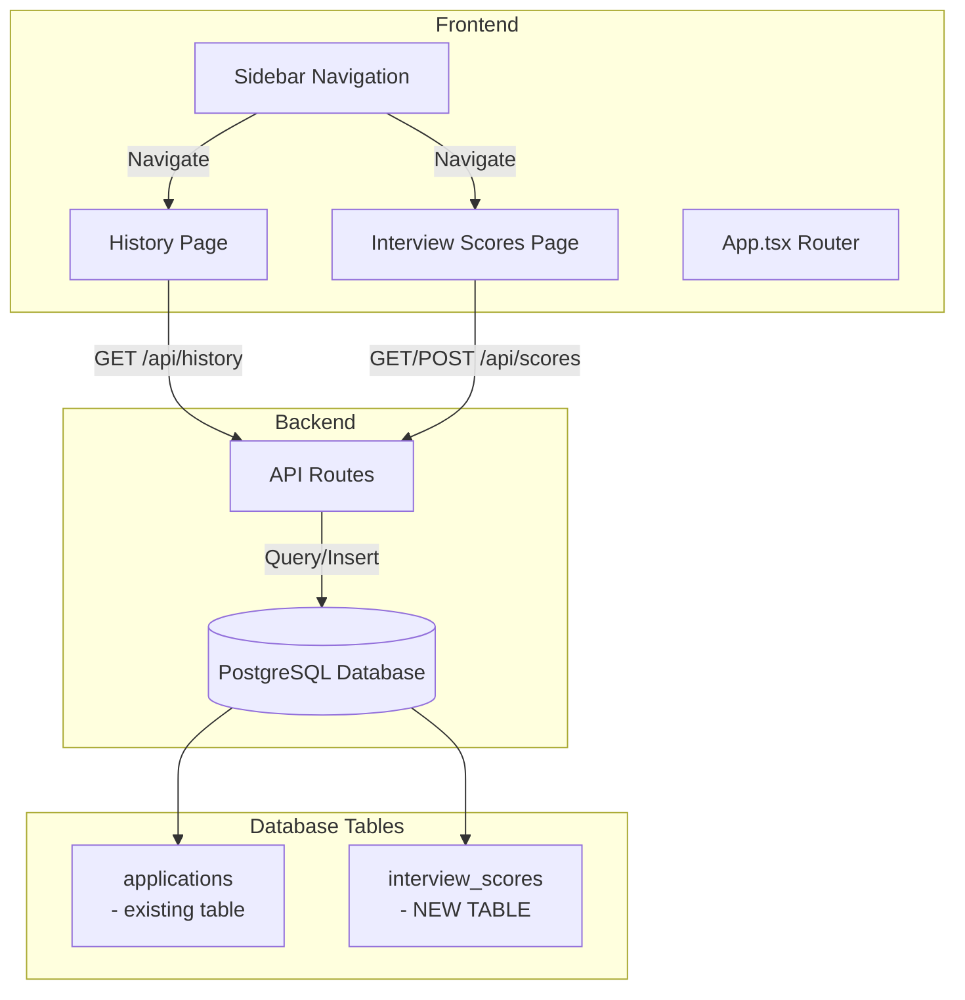

# Implementation Plan: History & Interview Scores Pages

## Overview

This plan outlines the creation of two new pages for the HireFlow application:

1. **History Page** (`/history`) - Displays candidates who have been Rejected or Hired
2. **Interview Scores Page** (`/scores`) - Allows saving interview scores and displays a ranked leaderboard

---

## Architecture Diagram



---

## Database Schema Changes

### New Table: `interview_scores`

```sql
CREATE TABLE IF NOT EXISTS interview_scores (
    id              UUID PRIMARY KEY DEFAULT gen_random_uuid(),
    candidate_id    UUID NOT NULL REFERENCES applications(id),
    job_id          UUID NOT NULL REFERENCES jobs(id),
    score           INTEGER NOT NULL CHECK (score >= 0 AND score <= 100),
    interviewer     TEXT NOT NULL,
    comments        TEXT,
    interview_date  DATE NOT NULL,
    created_at      TIMESTAMPTZ DEFAULT NOW()
);
```

---

## Page Specifications

### 1. History Page

**Route:** `history`

**Purpose:** Display all candidates who have been either Rejected or Hired

**Features:**
- Tabbed interface with two tabs: "Rejected" and "Hired"
- Display candidate name, email, role applied for, date of decision
- Filter by date range
- Search by name or email
- Export to CSV option

**Data Source:** 
- Candidates with `stageKey = 'Rejected'` or `stageKey = 'Hired'`
- From existing `applications` table where `status IN ('rejected', 'hired')`

---

### 2. Interview Scores Page

**Route:** `scores`

**Purpose:** Save interview scores and view ranked candidates

**Features:**

#### Section A: Score Entry Form
- Dropdown to select candidate (filterable)
- Dropdown to select job position
- Score input (0-100 scale)
- Interviewer name field
- Comments/notes textarea
- Interview date picker
- Submit button

#### Section B: Leaderboard
- List of all candidates who have interview scores
- Sorted by score (highest first)
- Display: Rank, Name, Role, Score, Interviewer, Date
- Visual indicator for top scorer (gold highlight)
- Filter by job/position

---

## Implementation Steps

### Step 1: Database Migration
- Add `interview_scores` table to database schema
- Add indexes for fast queries

### Step 2: Backend API Routes
- `GET /api/history` - Fetch rejected and hired candidates
- `GET /api/scores` - Fetch all interview scores
- `POST /api/scores` - Create new interview score entry
- `GET /api/scores/leaderboard` - Fetch scores sorted by rank

### Step 3: Frontend Types
- Add `InterviewScore` type to `src/types.ts`
- Add `'history' | 'scores'` to `ViewId` type

### Step 4: Components
- Create `src/components/HistoryPage.tsx`
- Create `src/components/InterviewScoresPage.tsx`

### Step 5: Navigation
- Add "History" and "Scores" to sidebar navigation items
- Update router to include new views
- Update App.tsx to handle new view rendering

---

## File Changes Summary

| File | Action | Description |
|------|--------|-------------|
| `server/db/migrations.sql` | Modify | Add interview_scores table |
| `server/routes/history.ts` | Create | New API route for history |
| `server/routes/scores.ts` | Create | New API route for scores |
| `server/server.ts` | Modify | Register new routes |
| `src/types.ts` | Modify | Add InterviewScore type, update ViewId |
| `src/components/HistoryPage.tsx` | Create | History page component |
| `src/components/InterviewScoresPage.tsx` | Create | Scores page component |
| `src/components/Sidebar.tsx` | Modify | Add new nav items |
| `src/app/router.tsx` | Modify | Add new lazy imports |
| `src/App.tsx` | Modify | Add new view handlers |

---

## UI Mockup: Interview Scores Page

```
┌─────────────────────────────────────────────────────────────┐
│  Interview Scores                                           │
├─────────────────────────────────────────────────────────────┤
│                                                             │
│  ┌─────────────────────┐  ┌─────────────────────────────┐  │
│  │  Save New Score     │  │  Leaderboard                │  │
│  │                     │  │                             │  │
│  │  Candidate: [▼]     │  │  🥇 John Doe    - 95        │  │
│  │  Job: [▼]           │  │  🥈 Jane Smith  - 92        │  │
│  │  Score: [____]      │  │  🥉 Mike Jones   - 88        │  │
│  │  Interviewer: [__]  │  │     Sarah Lee    - 85       │  │
│  │  Date: [____]       │  │     Tom Brown    - 82       │  │
│  │  Comments: [____]   │  │     ...                      │  │
│  │                     │  │                             │  │
│  │  [Save Score]      │  │                             │  │
│  └─────────────────────┘  └─────────────────────────────┘  │
│                                                             │
└─────────────────────────────────────────────────────────────┘
```

---

## Acceptance Criteria

1. ✅ History page displays both Rejected and Hired candidates in separate tabs
2. ✅ Interview Scores page has functional form to save scores
3. ✅ Leaderboard section shows candidates sorted by highest score first
4. ✅ Top scorer is visually highlighted
5. ✅ New pages appear in sidebar navigation
6. ✅ Data persists to database
7. ✅ UI follows existing application styling patterns
